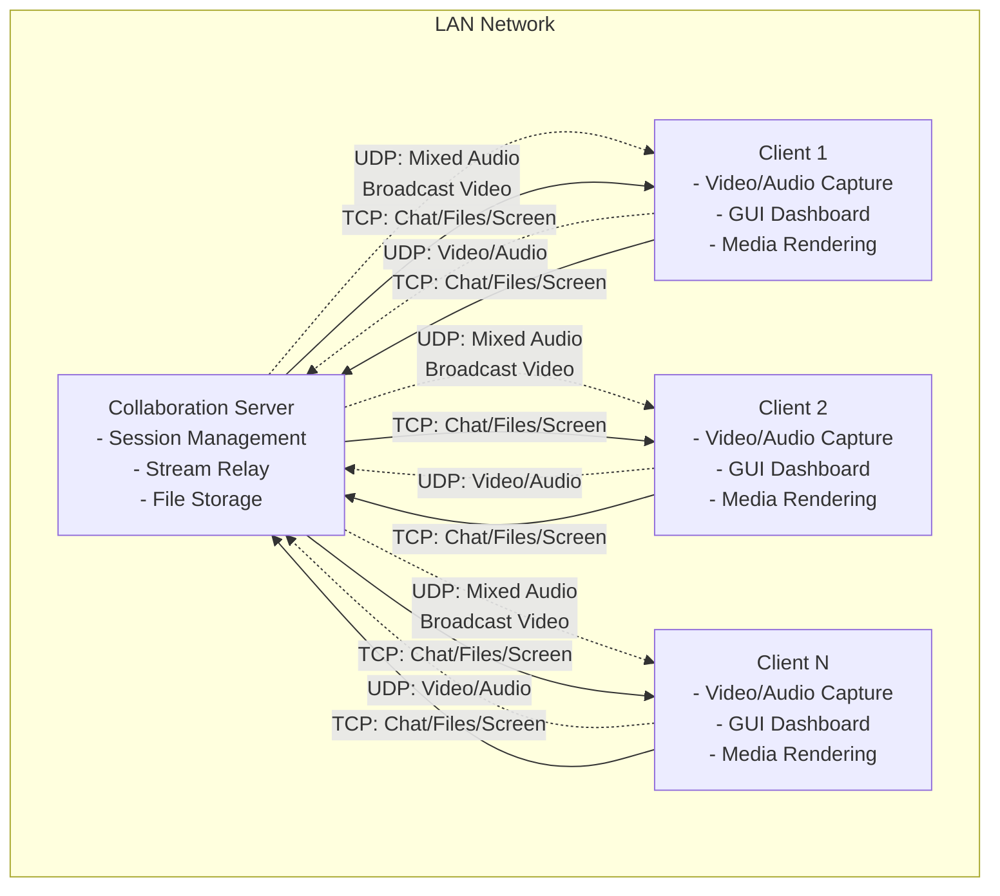

# Design Document

## Overview

The LAN-Based Multi-User Collaboration Suite follows a client-server architecture where a central server manages all communication and data relay between multiple clients. The system is designed for real-time collaboration without internet dependency, using a combination of UDP for low-latency audio/video streaming and TCP for reliable data transmission.

## Architecture

### High-Level Architecture



### Protocol Selection

- **UDP**: Used for audio and video streaming to minimize latency
- **TCP**: Used for chat messages, file transfers, and screen sharing to ensure reliability
- **Socket Programming**: Direct socket implementation for maximum control and performance

### Threading Model

- **Server**: Multi-threaded with dedicated threads for each client connection and separate threads for different protocol handlers
- **Client**: Multi-threaded with separate threads for audio/video capture, network communication, and GUI updates

## Components and Interfaces

### Server Components

#### 1. Session Manager
```python
class SessionManager:
    def __init__(self):
        self.clients = {}  # client_id -> ClientConnection
        self.active_presenter = None
        self.chat_history = []
        self.shared_files = {}
    
    def add_client(self, client_connection)
    def remove_client(self, client_id)
    def broadcast_message(self, message, sender_id)
    def set_presenter(self, client_id)
```

#### 2. Network Handler
```python
class NetworkHandler:
    def __init__(self, tcp_port, udp_port):
        self.tcp_socket = socket.socket(socket.AF_INET, socket.SOCK_STREAM)
        self.udp_socket = socket.socket(socket.AF_INET, socket.SOCK_DGRAM)
    
    def start_tcp_server()
    def start_udp_server()
    def handle_client_connection(client_socket)
```

#### 3. Media Relay
```python
class MediaRelay:
    def __init__(self):
        self.audio_mixer = AudioMixer()
        self.video_broadcaster = VideoBroadcaster()
    
    def process_audio_stream(self, audio_data, client_id)
    def process_video_stream(self, video_data, client_id)
    def broadcast_mixed_audio()
    def broadcast_video_streams()
```

### Client Components

#### 1. Connection Manager
```python
class ConnectionManager:
    def __init__(self, server_ip, tcp_port, udp_port):
        self.tcp_socket = None
        self.udp_socket = None
        self.connected = False
    
    def connect_to_server()
    def disconnect_from_server()
    def send_tcp_message(message)
    def send_udp_data(data)
```

#### 2. Media Capture
```python
class MediaCapture:
    def __init__(self):
        self.video_capture = cv2.VideoCapture(0)
        self.audio_capture = pyaudio.PyAudio()
        self.screen_capture = None
    
    def start_video_capture()
    def start_audio_capture()
    def start_screen_capture()
    def stop_all_capture()
```

#### 3. GUI Manager
```python
class GUIManager:
    def __init__(self):
        self.main_window = None
        self.video_grid = None
        self.chat_panel = None
        self.file_panel = None
    
    def create_main_interface()
    def update_video_grid(video_streams)
    def update_chat_display(messages)
    def update_participant_list(participants)
```

## Data Models

### Message Protocol

#### TCP Messages
```python
class TCPMessage:
    def __init__(self, msg_type, sender_id, data):
        self.type = msg_type  # 'chat', 'file_upload', 'file_request', 'screen_share'
        self.sender_id = sender_id
        self.timestamp = time.time()
        self.data = data
        
    def serialize() -> bytes
    def deserialize(data: bytes) -> TCPMessage
```

#### UDP Packets
```python
class UDPPacket:
    def __init__(self, packet_type, sender_id, sequence_num, data):
        self.type = packet_type  # 'audio', 'video'
        self.sender_id = sender_id
        self.sequence_num = sequence_num
        self.timestamp = time.time()
        self.data = data
        
    def serialize() -> bytes
    def deserialize(data: bytes) -> UDPPacket
```

### Client State
```python
class ClientState:
    def __init__(self, client_id):
        self.client_id = client_id
        self.username = ""
        self.video_enabled = False
        self.audio_enabled = False
        self.is_presenter = False
        self.connection_time = time.time()
```

### File Metadata
```python
class FileMetadata:
    def __init__(self, filename, filesize, uploader_id):
        self.filename = filename
        self.filesize = filesize
        self.uploader_id = uploader_id
        self.upload_time = time.time()
        self.file_id = uuid.uuid4()
```

## Error Handling

### Network Error Handling

1. **Connection Loss Detection**
   - Implement heartbeat mechanism with periodic ping/pong messages
   - Detect client disconnections within 5 seconds
   - Gracefully remove disconnected clients from session

2. **UDP Packet Loss**
   - Implement sequence numbering for video frames
   - Use adaptive frame rate based on network conditions
   - Skip corrupted or out-of-order packets for real-time performance

3. **TCP Connection Issues**
   - Implement connection retry logic with exponential backoff
   - Queue messages during temporary disconnections
   - Provide user feedback for connection status

### Media Processing Errors

1. **Camera/Microphone Access**
   - Detect device availability on startup
   - Provide fallback options when devices are unavailable
   - Handle device permission errors gracefully

2. **Codec Errors**
   - Implement fallback codecs for compatibility
   - Handle encoding/decoding failures without crashing
   - Provide quality degradation options under resource constraints

### File Transfer Errors

1. **Storage Limitations**
   - Check available disk space before file transfers
   - Implement file size limits and validation
   - Clean up temporary files on errors

2. **Transfer Interruptions**
   - Support resume functionality for large files
   - Provide clear error messages for failed transfers
   - Implement timeout handling for stalled transfers

## Testing Strategy

### Unit Testing

1. **Network Components**
   - Test socket creation and binding
   - Test message serialization/deserialization
   - Test connection handling edge cases

2. **Media Processing**
   - Test video compression/decompression
   - Test audio encoding/decoding
   - Test screen capture functionality

3. **Protocol Handling**
   - Test TCP message routing
   - Test UDP packet processing
   - Test error recovery mechanisms

### Integration Testing

1. **Client-Server Communication**
   - Test full connection lifecycle
   - Test multi-client scenarios
   - Test concurrent operations

2. **Media Streaming**
   - Test end-to-end video streaming
   - Test audio mixing and playback
   - Test screen sharing workflow

3. **File Transfer**
   - Test upload/download functionality
   - Test progress tracking accuracy
   - Test concurrent file operations

### Performance Testing

1. **Scalability Testing**
   - Test with increasing number of clients
   - Measure latency under load
   - Test bandwidth utilization

2. **Resource Usage**
   - Monitor CPU and memory usage
   - Test on different hardware configurations
   - Optimize for low-end systems

3. **Network Conditions**
   - Test under various network latencies
   - Test with limited bandwidth
   - Test packet loss scenarios

### User Interface Testing

1. **Responsiveness**
   - Test GUI updates under load
   - Test real-time display updates
   - Test user interaction responsiveness

2. **Cross-Platform Compatibility**
   - Test on Windows 10/11
   - Test on various Linux distributions
   - Test GUI consistency across platforms

3. **Usability Testing**
   - Test intuitive navigation
   - Test error message clarity
   - Test accessibility features

## Implementation Considerations

### Performance Optimizations

1. **Video Compression**
   - Use hardware acceleration when available
   - Implement adaptive bitrate based on network conditions
   - Optimize frame rate for real-time performance

2. **Audio Processing**
   - Use low-latency audio buffers
   - Implement echo cancellation
   - Optimize mixing algorithms for multiple streams

3. **Memory Management**
   - Implement efficient buffer management
   - Use memory pools for frequent allocations
   - Clean up resources promptly

### Security Considerations

1. **Network Security**
   - Implement basic authentication for server access
   - Validate all incoming data to prevent injection attacks
   - Use secure file handling practices

2. **Resource Protection**
   - Implement rate limiting for message sending
   - Prevent excessive resource consumption
   - Validate file types and sizes

### Cross-Platform Compatibility

1. **Library Selection**
   - Use cross-platform libraries (OpenCV, PyAudio, tkinter/PyQt5)
   - Handle platform-specific device access
   - Ensure consistent behavior across platforms

2. **File System Handling**
   - Use platform-independent path handling
   - Handle different file system permissions
   - Support various file formats consistently