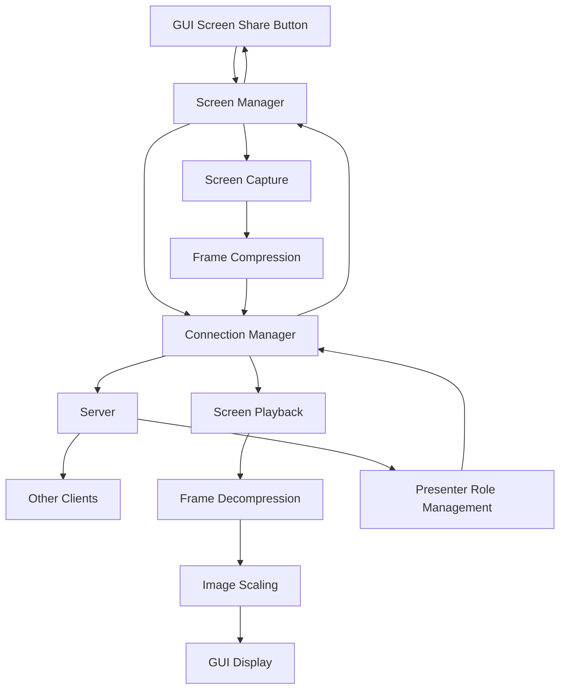

# Screen Sharing Fix Design Document

## Overview

This design addresses the critical issues preventing screen sharing from working in the LAN Collaboration Suite. The main problems identified are:

1. **Broken Screen Sharing Flow**: The screen sharing button click doesn't properly initiate screen sharing
2. **Display Scaling Issues**: Received screen frames show black borders instead of proper aspect ratio scaling
3. **Missing Error Handling**: Users don't receive feedback when screen sharing fails
4. **Incomplete Integration**: Screen manager isn't properly connected to GUI events

The solution involves fixing the callback chain from GUI → Screen Manager → Connection Manager → Server, implementing proper image scaling in the display component, and adding comprehensive error handling.

## Architecture

### Current Broken Flow
```
GUI Button Click → Screen Share Callback → ??? (Broken Chain)
```

### Fixed Flow
```
GUI Button Click → Screen Manager → Connection Manager → Server
                ↓
Server Response → Connection Manager → Screen Manager → GUI Update
                ↓
Screen Capture → Frame Processing → Network Transmission → Screen Display
```

### Component Interaction Diagram


## Components and Interfaces

### 1. Screen Manager Integration Fix

**Problem**: The screen manager is created but not properly connected to GUI callbacks.

**Solution**: 
- Fix the screen share callback in `main_client.py` to properly route to screen manager
- Ensure screen manager is initialized with correct client ID after connection
- Add proper error handling for screen manager operations

**Interface Changes**:
```python
class CollaborationClient:
    def _handle_screen_share_toggle(self, enabled: bool):
        """Fixed screen sharing toggle handler"""
        if not self.screen_manager:
            self._initialize_screen_manager()
        
        if enabled:
            success = self.screen_manager.request_presenter_role()
            if not success:
                self.gui_manager.show_error("Screen Share Error", "Failed to request presenter role")
        else:
            self.screen_manager.stop_screen_sharing()
```

### 2. Screen Display Scaling Fix

**Problem**: The `display_screen_frame` method in GUI manager has scaling issues and shows black borders.

**Solution**:
- Fix aspect ratio calculation to prevent distortion
- Remove black space by properly centering scaled images
- Ensure canvas updates properly when receiving frames
- Add minimum scale factor to prevent tiny images

**Interface Changes**:
```python
class ScreenShareFrame:
    def display_screen_frame(self, frame_data, presenter_name: str):
        """Fixed screen frame display with proper scaling"""
        # Convert frame data to PIL Image
        image = Image.open(io.BytesIO(frame_data))
        
        # Get canvas dimensions and ensure it's ready
        self.screen_canvas.update_idletasks()
        canvas_width = self.screen_canvas.winfo_width()
        canvas_height = self.screen_canvas.winfo_height()
        
        if canvas_width > 10 and canvas_height > 10:
            # Calculate proper scaling maintaining aspect ratio
            img_width, img_height = image.size
            scale_w = canvas_width / img_width
            scale_h = canvas_height / img_height
            scale = min(scale_w, scale_h)  # Fit within canvas
            
            # Apply minimum scale to ensure visibility
            scale = max(scale, 0.2)
            
            new_width = int(img_width * scale)
            new_height = int(img_height * scale)
            
            # Resize image with high quality
            image = image.resize((new_width, new_height), Image.LANCZOS)
            
            # Convert to PhotoImage
            photo = ImageTk.PhotoImage(image)
            
            # Clear canvas and center image (no black borders)
            self.screen_canvas.delete("all")
            x = (canvas_width - new_width) // 2
            y = (canvas_height - new_height) // 2
            
            self.screen_canvas.create_image(x, y, anchor='nw', image=photo)
            self.screen_canvas.image = photo  # Keep reference
```

### 3. Connection Manager Screen Sharing Methods

**Problem**: Screen sharing methods exist but may have issues with message creation or sending.

**Solution**:
- Verify message factory methods create proper screen sharing messages
- Add retry logic for failed screen sharing requests
- Improve error reporting from connection manager to screen manager

**Interface Changes**:
```python
class ConnectionManager:
    def request_presenter_role(self) -> tuple[bool, str]:
        """Enhanced presenter role request with error details"""
        if not self._is_connected():
            return False, "Not connected to server"
        
        try:
            presenter_request = MessageFactory.create_presenter_request_message(self.client_id)
            success = self._send_tcp_message(presenter_request)
            
            if success:
                return True, "Presenter role request sent"
            else:
                return False, "Failed to send presenter role request"
        except Exception as e:
            return False, f"Error requesting presenter role: {e}"
```

### 4. Screen Capture Initialization

**Problem**: Screen capture may fail to initialize properly or have platform-specific issues.

**Solution**:
- Add better platform capability checking
- Provide clearer error messages for screen capture failures
- Add fallback options for different screen capture methods

**Interface Changes**:
```python
class ScreenCapture:
    def start_capture(self) -> tuple[bool, str]:
        """Enhanced screen capture start with detailed error reporting"""
        if not self.capture_available:
            return False, "Screen capture not available on this platform"
        
        try:
            # Test screen capture first
            test_screenshot = self._capture_screen()
            if test_screenshot is None:
                return False, "Failed to capture test screenshot - check permissions"
            
            # Start capture thread
            self.is_capturing = True
            self.capture_thread = threading.Thread(target=self._capture_loop, daemon=True)
            self.capture_thread.start()
            
            return True, "Screen capture started successfully"
        except Exception as e:
            return False, f"Screen capture failed: {e}"
```

## Data Models

### Screen Frame Message Structure
```python
{
    "msg_type": "screen_share",
    "sender_id": "client_123",
    "data": {
        "sequence_num": 42,
        "frame_data": "hex_encoded_jpeg_data",
        "timestamp": 1234567890.123,
        "resolution": {
            "width": 1920,
            "height": 1080
        },
        "compression_quality": 30
    }
}
```

### Presenter Role Messages
```python
# Request
{
    "msg_type": "presenter_request",
    "sender_id": "client_123",
    "data": {}
}

# Grant Response
{
    "msg_type": "presenter_granted", 
    "sender_id": "server",
    "data": {
        "presenter_id": "client_123"
    }
}

# Deny Response
{
    "msg_type": "presenter_denied",
    "sender_id": "server", 
    "data": {
        "reason": "Another user is already presenting"
    }
}
```

## Error Handling

### Screen Sharing Error Categories

1. **Connection Errors**: Network issues preventing screen sharing messages
   - Retry mechanism with exponential backoff
   - User notification with retry option
   - Graceful degradation to local-only mode

2. **Platform Errors**: Screen capture not available or permission denied
   - Platform-specific error messages
   - Suggestions for enabling screen capture permissions
   - Alternative capture methods where available

3. **Resource Errors**: Insufficient memory or processing power
   - Automatic quality reduction
   - Frame rate throttling
   - User notification of performance adjustments

4. **Server Errors**: Presenter role conflicts or server issues
   - Clear error messages from server
   - Automatic retry for transient errors
   - Queue system for presenter role requests

### Error Recovery Strategies

```python
class ScreenSharingErrorHandler:
    def handle_screen_capture_error(self, error: Exception) -> tuple[bool, str]:
        """Handle screen capture errors with recovery options"""
        if "permission" in str(error).lower():
            return False, "Screen capture permission denied. Please enable screen recording permissions in system settings."
        elif "not available" in str(error).lower():
            return False, "Screen capture not available on this platform. Please check system requirements."
        else:
            return False, f"Screen capture failed: {error}. Please try again."
    
    def handle_network_error(self, error: Exception) -> tuple[bool, str]:
        """Handle network errors during screen sharing"""
        if "connection" in str(error).lower():
            return False, "Network connection lost. Please check your connection and try again."
        else:
            return False, f"Network error during screen sharing: {error}"
```

## Testing Strategy

### Unit Tests
- Screen capture initialization and frame processing
- Image scaling algorithms with various aspect ratios
- Message serialization/deserialization for screen sharing
- Error handling for different failure scenarios

### Integration Tests
- End-to-end screen sharing flow from button click to display
- Multi-client screen sharing with presenter role switching
- Network failure recovery during active screen sharing
- Platform-specific screen capture functionality

### Manual Testing Scenarios
1. **Basic Screen Sharing**: Click button → verify screen appears on other clients
2. **Aspect Ratio Testing**: Test with different screen resolutions (4:3, 16:9, 21:9)
3. **Error Scenarios**: Test with screen capture disabled, network disconnection
4. **Multi-User**: Test presenter role switching between multiple users
5. **Performance**: Test with high-resolution screens and multiple participants

### Test Data
- Sample screen captures at different resolutions
- Mock network messages for various screen sharing scenarios
- Error injection for testing failure recovery
- Performance benchmarks for different screen sizes and compression levels